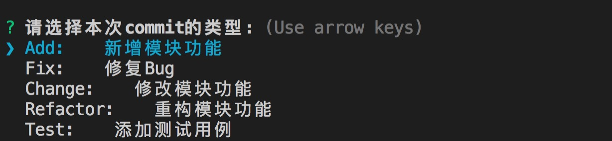

# baiji-cz-rule

本项目修改自 [cz-custom-enhanced](https://github.com/lsa2127291/cz-custom-enhanced)



## Steps
* 首选需要安装commitizen插件: `npm install -g commitizen`.
* 然后再安装: `npm install baiji-cz-rule --save-dev`
* 最后通过配置让 `commitizen` 使用 `baiji-cz-rule` 作为插件。 你需要在`package.json`中加入如下几行代码:

  ```
  "config": {
    "commitizen": {
      "path": "node_modules/baiji-cz-rule"
    }
  }
  ```

* 之后使用 git 提交代码时，使用 git cz 替换 git commit
